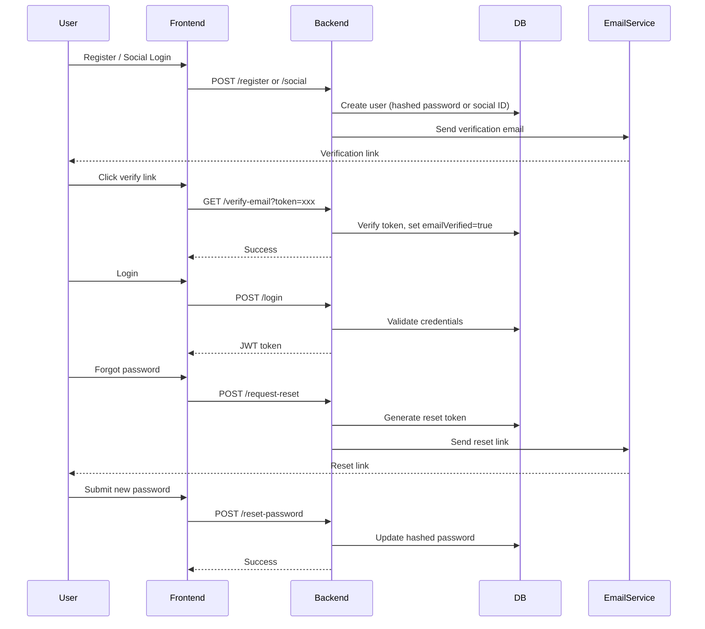

# Authentication Architecture Plan

## Overview
This plan outlines a secure, scalable authentication system supporting:
- JWT-based authentication
- Social login (Microsoft, Google, GitHub)
- Email verification
- Password reset functionality

---

## 1. Backend Enhancements

### User Model Updates
- `email` (unique, required)
- `emailVerified` (boolean, default false)
- `verificationToken` (nullable string)
- `resetToken` (nullable string)
- `resetTokenExpiry` (nullable datetime)
- `provider` (enum: local, google, github, microsoft)

### Auth Endpoints

| Endpoint                     | Method | Description                                 |
|------------------------------|--------|---------------------------------------------|
| `/api/auth/register`         | POST   | Register with email/password, send verify email |
| `/api/auth/login`            | POST   | Login with email/password, return JWT       |
| `/api/auth/social`           | POST   | Social login callback, return JWT           |
| `/api/auth/verify-email`     | GET    | Verify email with token                     |
| `/api/auth/request-reset`    | POST   | Request password reset, send email          |
| `/api/auth/reset-password`   | POST   | Reset password with token                   |
| `/api/auth/refresh-token`    | POST   | Refresh JWT                                 |

### Auth Flow Overview

---

## 2. Frontend Enhancements

- **Auth Context**: Manage JWT, user info, login/logout, refresh
- **SignIn/SignUp**: Call `/register` and `/login`
- **Social Login Buttons**: Redirect to OAuth providers, handle callback
- **Email Verification UI**: Show verification status, resend option
- **Password Reset UI**: Request reset, submit new password
- **Protected Routes**: Redirect unauthenticated users

---

## 3. Social Login Integration

- Use OAuth 2.0 with Microsoft, Google, GitHub
- Backend handles OAuth callback, exchanges code for user info
- If user exists, issue JWT; else, create user with provider info
- Link social accounts to existing users if needed

---

## 4. Security Best Practices

- Hash passwords with bcrypt (cost factor 12+)
- Sign JWTs with strong secret, short expiry (15m access, 7d refresh)
- Store refresh tokens securely (HTTP-only cookies)
- Rate limit auth endpoints
- Validate all inputs
- Use HTTPS in production
- Do not expose sensitive error messages

---

## 5. Next Steps

- Update Prisma schema with new fields
- Implement backend auth routes and services
- Integrate OAuth providers
- Enhance frontend auth flows
- Add email service (e.g., SendGrid, SES)
- Write tests for all flows