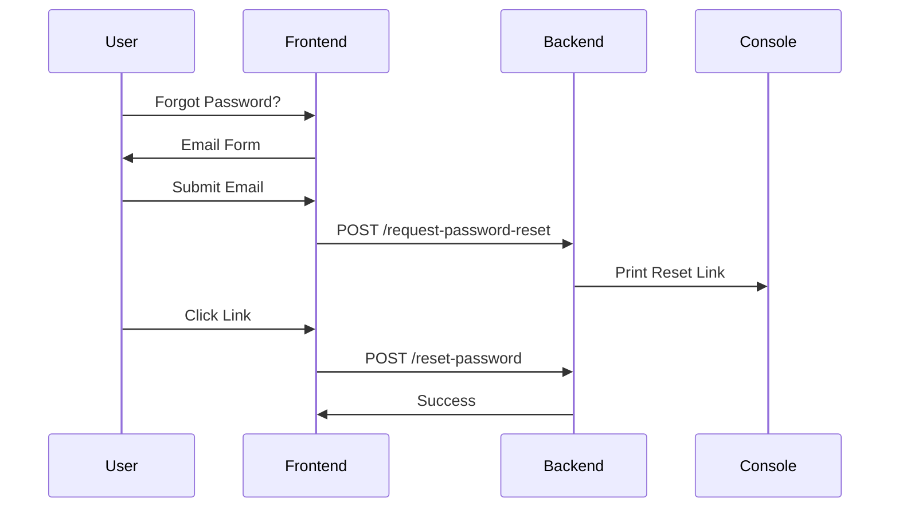

# Password Reset Feature Plan

## Overview
This document outlines the implementation plan for the "Forgot Password" feature, including a development-mode shortcut for environments without email capabilities.

## User Flow
1. User clicks "Forgot Password?" on sign-in page
2. User enters email address
3. System generates password reset link:
   - Production: Link sent via email
   - Development: Link printed to console/logs
4. User clicks reset link
5. User sets new password

## Implementation Details

### Frontend Changes
- Add "Forgot Password?" link to SignIn.tsx
- Create email input form
- Add password reset confirmation page
- Implement new password form

### Backend Changes
- Implement `/request-password-reset` endpoint:
  ```javascript
  if (process.env.REQUIRE_EMAIL_VERIFICATION === 'false') {
    console.log(`Reset link: ${resetUrl}`);
  } else {
    // Send email logic
  }
  ```
- Implement `/reset-password` endpoint
- Add token validation
- Update password storage

### Environment Configuration
Add to `.env`:
```
REQUIRE_EMAIL_VERIFICATION=false # For development
```

## Sequence Diagram


## Testing Plan
1. Development mode:
   - Verify link appears in console
   - Test full reset flow
2. Production mode:
   - Configure email service
   - Test email delivery
   - Verify security

## Next Steps
1. Implement frontend components
2. Develop backend endpoints
3. Add tests
4. Document API changes