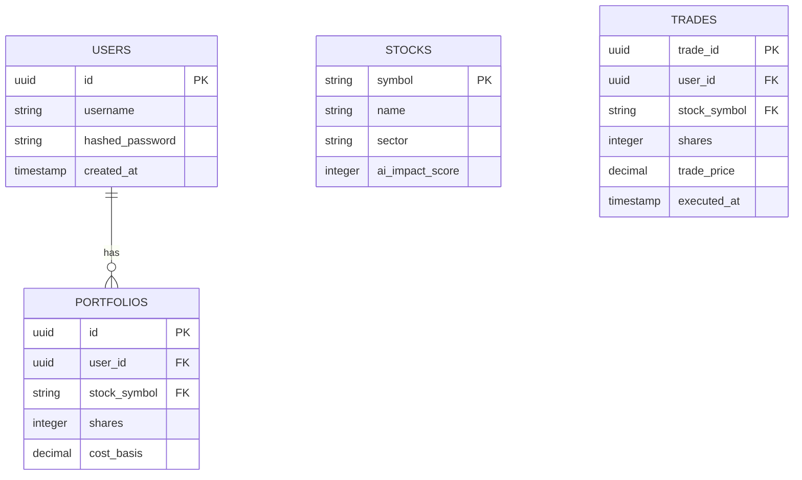
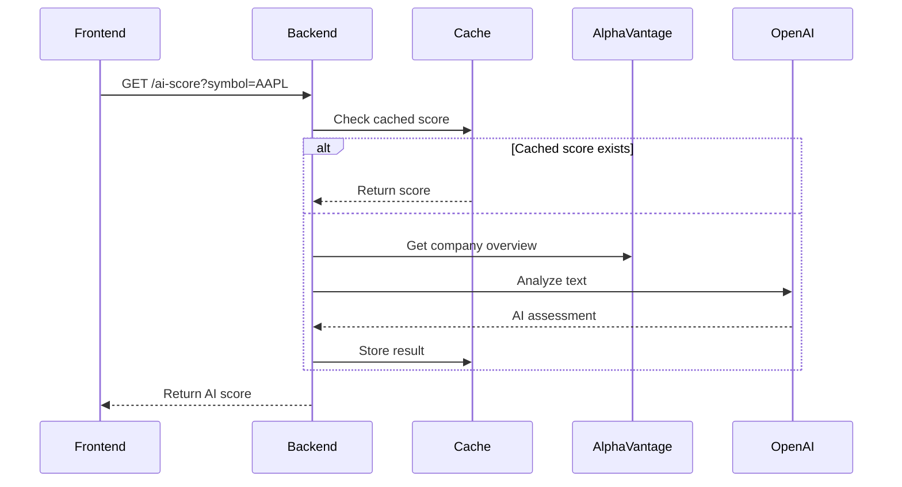
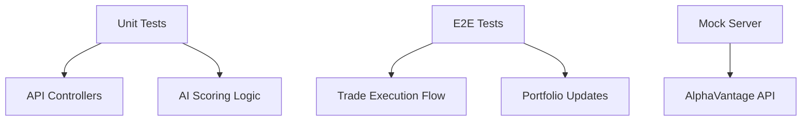

# Stock Feature Implementation Guide

## Database Schema Design


## API Endpoints
```mermaid
graph TD
    Auth[/auth/*] --> Login[/login]
    Auth --> Signup[/signup]
    Stocks[/stocks/*] --> List[/]
    Stocks --> Detail[/:symbol]
    Portfolio[/portfolio/*] --> Holdings[/]
    Portfolio --> History[/history]
```

## Frontend Component Architecture
```tsx
// Example StockCard component integration
interface StockCardProps {
  symbol: string;
  price: number;
  impactScore: number;
  onChange: (newScore: number) => void;
}

const StockCard: React.FC<StockCardProps> = ({ symbol, price, impactScore }) => (
  <div className="stock-card">
    <div className="header">
      <h3>{symbol}</h3>
      <span className={`score ${impactScore > 0 ? 'positive' : 'negative'}`}>
        {impactScore}
      </span>
    </div>
    <div className="price">${price.toFixed(2)}</div>
  </div>
);
```

## AI Integration Flow


## Testing Strategy


## Environment Setup
```bash
# Required .env variables
ALPHA_VANTAGE_API_KEY=your_key_here
OPENAI_API_KEY=your_key_here
DB_HOST=localhost
DB_NAME=nerdy_stocks