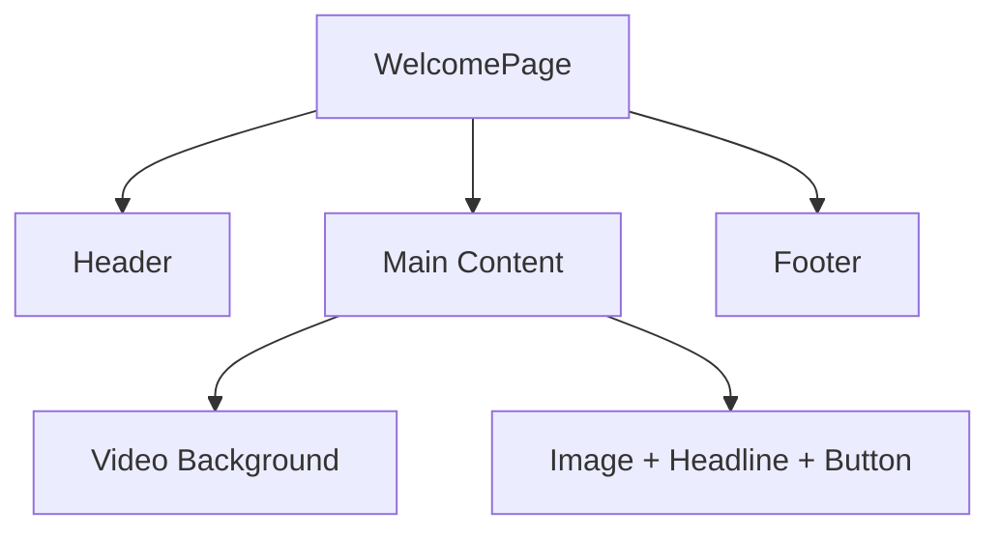

# Code Review: `frontend/src/components/WelcomePage.tsx`

## Strengths

- **Separation of Concerns:** The component is focused and only handles the welcome page UI.
- **Use of React Hooks:** `useState` is used appropriately for video cycling.
- **Clean JSX Structure:** The layout is clear, with semantic separation of header, main content, and footer.
- **Tailwind CSS:** Consistent use of utility classes for styling.
- **Accessibility:** `alt` attributes are present for images.

---

## Suggestions for Improvement

### 1. Accessibility

- **Search Input:** The search input is missing a label. For accessibility, add a visually hidden label or use `aria-label`:
  ```jsx
  <input
    type="text"
    aria-label="Search for AI impacts, Robotics companies, AI Stock Winners and Losers"
    ...
  />
  ```
- **Button Label:** The "See more" button could be more descriptive for screen readers, e.g., `aria-label="See another robot video"`.

### 2. Performance

- **Video Preloading & Bundle Size:** Importing all video files directly into the component increases the initial JavaScript bundle size, which can slow down page load times, especially for users on slower connections. To improve performance:
  - Consider lazy-loading videos only when needed (e.g., when the user clicks "See more" or when the video is about to be shown).
  - Store video URLs in a configuration file or serve them from a CDN to reduce the bundle size and leverage browser caching.
  - Use dynamic `import()` or React's `lazy`/`Suspense` for video components if you split them out.
- **Image Optimization:** Ensure all images used on the welcome page are optimized for web (compressed, appropriate resolution). Use modern formats like WebP where possible.
- **Efficient State Management:** The current use of `useState` for video cycling is appropriate. If the component grows, consider using `useMemo` or `useCallback` to prevent unnecessary re-renders.
- **Avoid Unnecessary Renders:** If you extract video or header sections into their own components, use `React.memo` to avoid re-rendering unless props change.
- **Tailwind CSS JIT:** Tailwind's JIT mode is efficient, but avoid generating excessive utility classes dynamically, as this can impact build performance.
- **Video Key Prop:** If you render a list of videos or dynamic video elements, always provide a unique `key` prop to help React optimize rendering.
- **Testing on Slow Networks:** Use Chrome DevTools to simulate slow network conditions and ensure the welcome page remains responsive and visually complete quickly.

By addressing these points, the welcome page will load faster and provide a smoother experience, especially for first-time visitors.

### 3. Code Quality

- **Constants Outside Component:** The `videos` array can be defined outside the component to avoid re-creating it on every render:
  ```js
  const videos = [robot1, robot2, robot3, robot4, robot5, robot6, robot7];

  const WelcomePage: React.FC = () => { ... }
  ```
- **Random Index Initialization:** Your use of a function in `useState` for the initial value is good practice.

### 4. User Experience

- **Search Functionality:** The search input is currently static. If you plan to implement search, consider adding a handler or placeholder comment for future devs.
- **Responsive Design:** The use of Tailwind's responsive classes is good, but test on mobile to ensure the video and images scale well.

### 5. Maintainability

- **Component Size:** The file is under 70 lines, which is good. If it grows, consider extracting the header or video section into their own components.
- **Magic Strings:** The placeholder text and button label are hardcoded. If you plan to localize, move these to a constants file.

### 6. Security

- **No direct security issues** in this component, but always validate user input if you implement the search.

---

## Example: Accessibility & Code Quality Improvements

```jsx
// Move videos array outside the component
const videos = [robot1, robot2, robot3, robot4, robot5, robot6, robot7];

const WelcomePage: React.FC = () => {
  const [videoIndex, setVideoIndex] = useState(() => Math.floor(Math.random() * videos.length));

  const handleSeeMore = () => {
    setVideoIndex((prevIndex) => (prevIndex + 1) % videos.length);
  };

  return (
    <div className="flex flex-col min-h-screen w-full">
      <header ...>
        ...
        <input
          type="text"
          aria-label="Search for AI impacts, Robotics companies, AI Stock Winners and Losers"
          ...
        />
        ...
      </header>
      <div ...>
        <video ... />
        <div ...>
          
          <h1 ...>Change is coming.....</h1>
          <button
            className="px-6 py-2 rounded-full bg-gray-200 hover:bg-gray-300 transition"
            onClick={handleSeeMore}
            aria-label="See another robot video"
          >
            See more
          </button>
        </div>
      </div>
      <Footer />
    </div>
  );
};
```

---

## Mermaid Diagram: Component Structure



---

## Summary

- The component is well-structured and easy to read.
- Focus on accessibility improvements and minor code quality tweaks.
- If the project grows, consider splitting into smaller components.
- No major issues found; keep up the clean and organized approach!