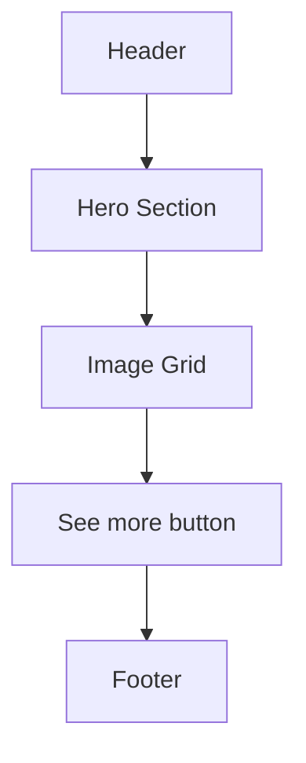

# Welcome Page Design & Specification

## Overview
Create a modern, Pinterest-inspired welcome page with:
- Reuse of existing Header and Footer components
- Prominent Sign Up and Log In buttons linking to `/signup` and `/signin`
- A hero section with a headline and a placeholder search bar
- A grid of image cards with overlay text (static placeholders for now)
- A "See more" button
- Clean, responsive design using Tailwind CSS

---

## Layout Diagram



---

## Component Breakdown

### Header
- Reuse `Header.tsx`
- Contains logo, navigation, and possibly Sign In/Sign Up buttons (if not, add them in Hero)

### Hero Section
- Large, bold headline: _"Explore the best of [Your App]"_
- Centered search bar (non-functional placeholder)
- Prominent **Sign Up** and **Log In** buttons linking to `/signup` and `/signin`
- Clean white background, plenty of whitespace

### Image Grid
- 2-3 rows of image cards (3 per row on desktop, 1-2 on mobile)
- Each card:
  - Rounded corners (`rounded-2xl`)
  - Placeholder image (static URL or local asset)
  - Overlay text with title and subtitle
  - Hover effect (slight zoom or shadow)
- Use Tailwind CSS grid or flex utilities

### See More Button
- Centered below grid
- Rounded, subtle button (gray background)
- Placeholder action (no link needed now)

### Footer
- Reuse `Footer.tsx`

---

## Styling Approach

- Use **Tailwind CSS** for layout, spacing, typography, rounded corners, hover effects
- Consistent with existing dashboards
- Minimal Material UI usage unless needed
- Responsive design:
  - Mobile: single column, stacked layout
  - Tablet: 2 columns
  - Desktop: 3 columns grid

---

## Routing

- **Sign Up:** `/signup`
- **Sign In:** `/signin`
- Use `<Link>` components from React Router (or your routing lib) for navigation

---

## Implementation Steps

1. **Create `WelcomePage.tsx`** in `frontend/src/components/`
2. **Import and reuse** `Header` and `Footer`
3. **Build Hero section** with headline, search bar, and buttons
4. **Create static image grid** with placeholder images and overlay text
5. **Add "See more" button** below grid
6. **Style with Tailwind CSS** for responsiveness and modern look
7. **Add routing links** to `/signin` and `/signup`
8. **Integrate into app routing** (e.g., as `/` or `/welcome` route)

---

## Sample Wireframe

```
+-----------------------------------------------------+
| [Header: Logo | Search Bar | Log in | Sign up]      |
+-----------------------------------------------------+
|                                                     |
|   [Video background: robot videos cycling]           |
|   +---------------------------------------------+   |
|   |                                             |   |
|   |   [Overlay:                                 |   |
|   |     - "We Are Here" image                   |   |
|   |     - "Change is coming....." headline      |   |
|   |     - [See more] button                     |   |
|   |   ]                                         |   |
|   +---------------------------------------------+   |
|                                                     |
+-----------------------------------------------------+
| [Footer]                                            |
+-----------------------------------------------------+
```

---

## Notes
- Placeholder images can be from Unsplash or local assets.
- Overlay text can be hardcoded for now.
- Search bar is non-functional, just styled input.
- Keep code modular and clean for future dynamic content integration.
- Write tests for rendering and navigation links.