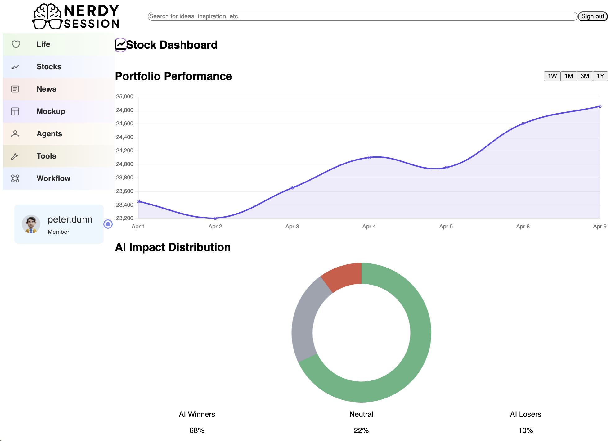

<p align="center">
  
</p>

# Nerdy Sessions Frontend

A modern, responsive frontend for **Nerdy Sessions**, built with React, TypeScript, Vite, and TailwindCSS. It provides dashboards, configuration management, and access to backend services.

---

## Tech Stack

- **React 18** with **TypeScript**
- **Vite** for fast development and build tooling
- **TailwindCSS** for utility-first styling
- **ESLint** for code quality and consistency

---

## Features

- Multiple interactive dashboards (Agents, Tools, Workflows, News, Stock, Life)
- User authentication (Sign In / Sign Up)
- Configurable sidebar navigation
- Responsive design optimized for all devices
- Integration with backend REST API

---

## Project Structure

```
/nerdy_sessions
│
├── backend/                 # Backend API server
│
└── frontend/                # This React frontend
    ├── src/
    │   ├── components/      # React components
    │   ├── App.tsx         # Main app component
    │   └── main.tsx        # Entry point
    ├── index.html
    └── README.md
```

---

## Environment Variables

Create a `.env` file in `frontend/` with:

```
VITE_API_URL=http://localhost:5001
```

This points the frontend to the backend API server.

---

## Getting Started

Install dependencies:

```bash
npm install
```

Run the development server:

```bash
npm run dev
```

Build for production:

```bash
npm run build
```

Preview production build:

```bash
npm run preview
```

---

## API Integration

- The frontend communicates with the backend API at `${VITE_API_URL}/api`.
- Interactive API docs are available at `${VITE_API_URL}/docs` (Swagger UI).
- See `backend/openapi.yaml` for the OpenAPI spec.

---

## Available Routes

- `/` — Main dashboard
- `/signin` — User login
- `/signup` — User registration

---

## Linting

ESLint is configured for React + TypeScript. To run lint checks:

```bash
npm run lint
```

---

## Screenshots




---

## License

ISC
